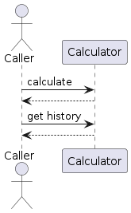

# Clean Code Exercise

This repository contains an exercise designed for the Clean Code training. It includes documentation and unit tests that cover both positive and negative scenarios for the mathematical operations of addition, subtraction, multiplication, and division.

## Calculator

Class `Calculator` is already present and has two methods:

`calculate(expression)` - Responsible for executing the operations  
`getHistory()` - Responsible for returing the history of executions  


The goal is to implement the logic for _addition_, _subtraction_, _multiplication_ and _division_, as well as the logic to return the history of executions.



This exercise consists in creating a simple calculator program which performs the following operations:

### Addition
```
Double result = calculator.calculate("1 + 1");
// expected result: 2.0
```

### Sutraction
```
Double result = calculator.calculate("10 - 1");
// expected result: 9.0
```

### Multiplication
```
Double result = calculator.calculate("5 * 4");
// expected result: 20.0
```

### Division
```
Double result = calculator.calculate("80 / 10");
// expected result: 8.0
```

### History

History is a list of string, which as format "n1 + operation + n2 + '=' + result" -> "1 + 2 = 3" 
```
Double result = calculator.calculate("10 + 10");
// expected result: 20.0
List<String> history = calculator.getHistory();
// expected result: [10 + 10 = 20]
```

### Completion

It is not allowed to change the signature of method `calculate` of `Calculator class`, neither change the tests. Other than that, you are free to implement the logic the way you want.

**The exercise is completed when all tests of `CalculatorTest` are passing.**

### Hint

 To format decimal `1.0` to integer string `1`, you can use `String.format("%.0f", 1D);`